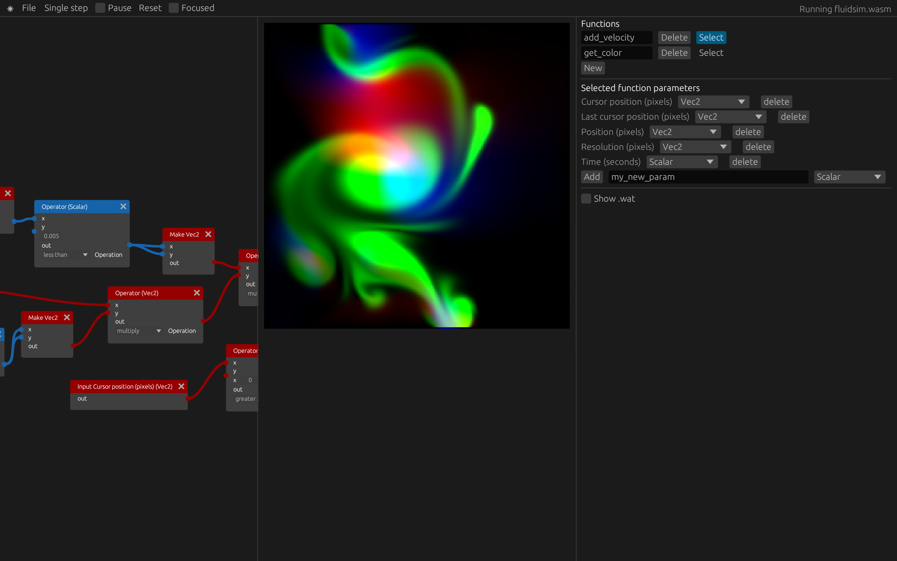

# Vorpal
Vorpal is a Domain Specific Language designed to be edited with a node graph user interface. The language is extremely simple, and actually is easily represented by a Directed Acyclic Graph. This is because Vorpal is intended to be compiled to other languages, such as WebAssembly or GLSL.

Vorpal's main purpose is to serve as a prototyping tool for physical simulations and interactive art; any high-performance, creative application may benefit from such a tool.

Vorpal is work in progress, and is **not yet ready for production use**

## How it works
The `vorpal-ui` application allows a user to edit a node graph, mapping a few scalar and vector inputs to exactly one vector output. 

**The node graph is then compiled into WebAssembly, which is then linked with some user code and run in the `wasmtime` WebAssembly runtime.**

The results are displayed visually.

This is similar to other "playground" environments such as Shadertoy.

## TODO:
### vorpal-ui 
- [ ] More output types besides image, e.g. mesh data, opengl, etc.
- [ ] Use `egui_dock` or similar
- [ ] Ask the user if they _really_ want to load defaults

### vorpal-widgets
- [ ] Swizzling node, which is compiled to the instructions vorpal-core knows

### vorpal-core
- [ ] {1,2,3,4}-dimensional texture samplers
- [ ] More datatypes (bool, int, ...)
- [ ] Lerp operator
- [ ] GLSL backend

### vorpal-wasm
- [ ] Better optimization
